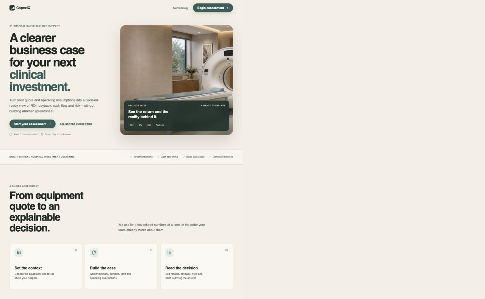
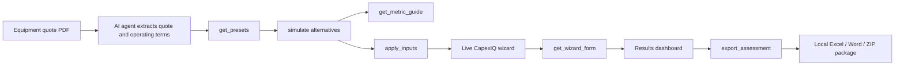
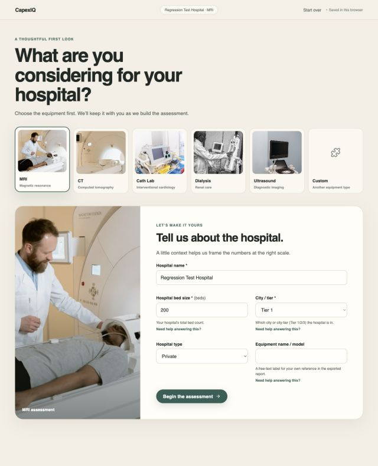
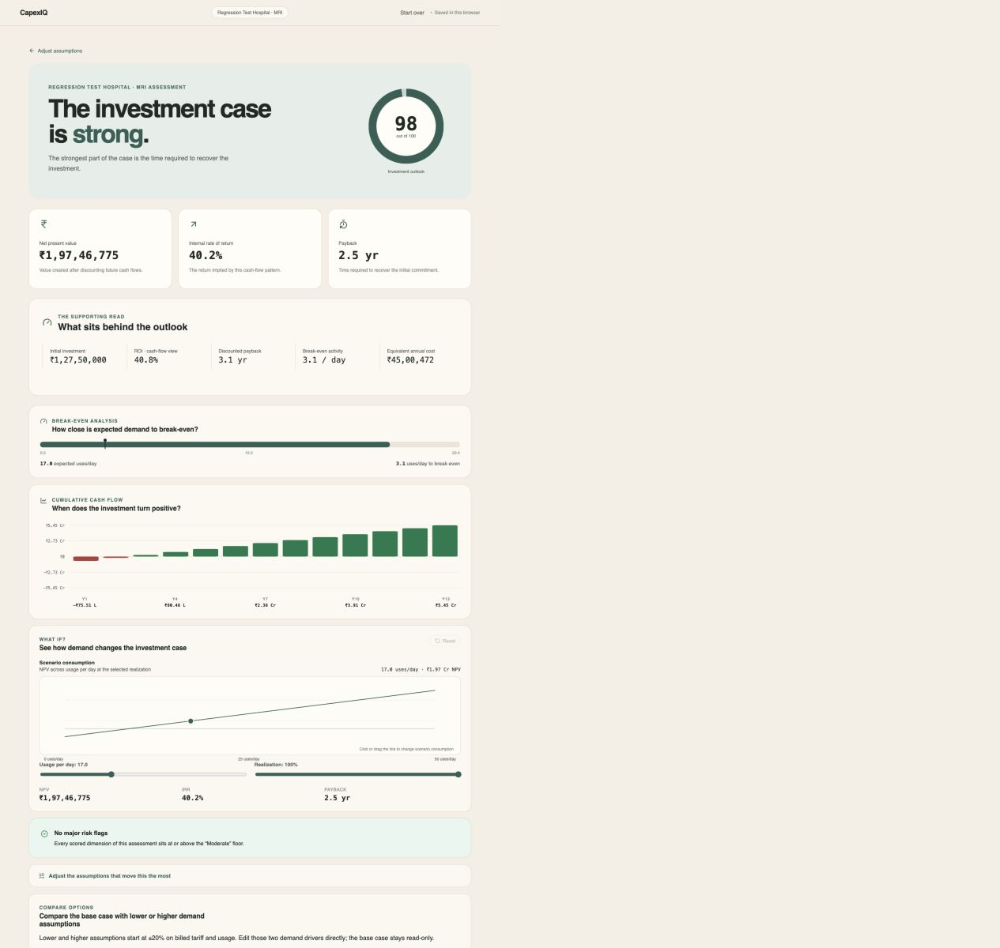
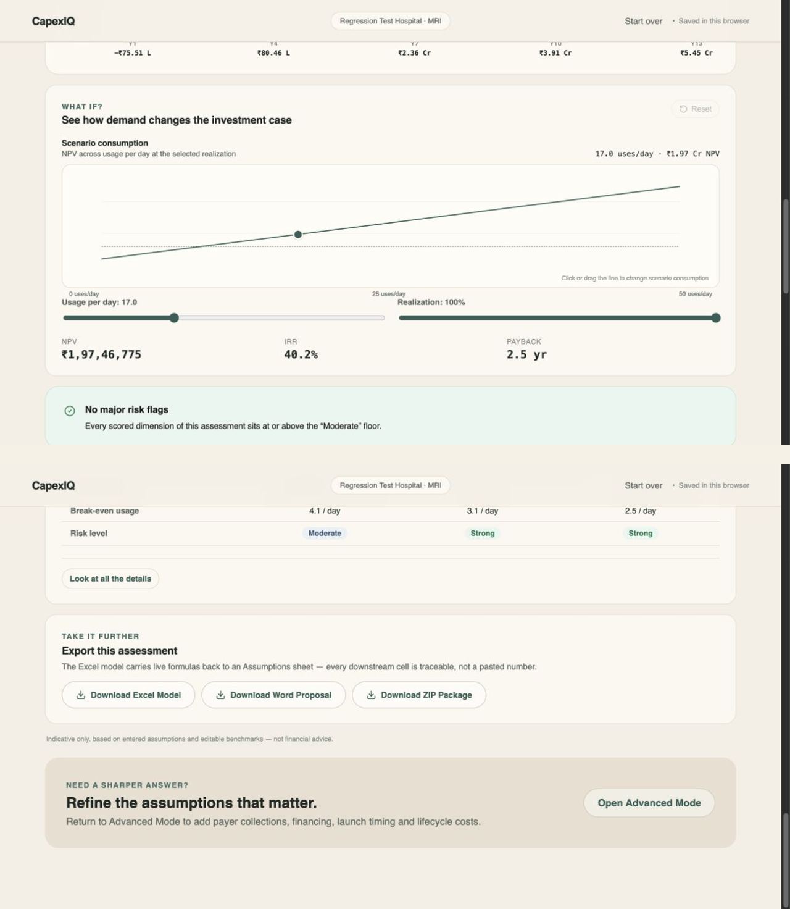

# CapexIQ

### Know if it pays for itself, before you buy it.

[](https://capexiq.jaybharti.me/)
[](https://vitest.dev/)
[](https://developer.chrome.com/)
[](https://www.typescriptlang.org/)
[](https://nextjs.org/)
[](LICENSE)

CapexIQ is a browser-first capital-equipment decision-support system for Indian
hospitals. It turns a vendor quote and operating assumptions into an explainable
view of utilization, revenue realization, collection timing, lifecycle costs,
cash flow, NPV, IRR, payback, break-even usage, risk, and board-ready exports.

<p align="center">
  <a href="https://capexiq.jaybharti.me/">
    
  </a>
</p>
<p align="center"><em>A calm, decision-led interface for turning an equipment quote into a case the decision room can explain.</em></p>

## What makes CapexIQ better

Hospital capital decisions depend on timing and operating reality—not only on
the equipment price. CapexIQ keeps the drivers visible, editable, and traceable
from the first assumption to the final decision brief.

| Common gap in a basic spreadsheet | How CapexIQ helps |
| --- | --- |
| Government-scheme DSO lags of 60–120 days disappear inside a blended revenue line. | Billed revenue, realized revenue, payer mix, collection delays, working-capital gaps, and cash receipts remain separate inputs and outputs. |
| A Year-6 warranty-to-CMC maintenance cliff is hidden by one average annual cost. | The model carries a warranty → CMC → AMC schedule and exposes the lifecycle cost transition. |
| A single-point formula corruption can quietly poison every copied scenario. | Pure formulas feed the preview, dashboard, scenarios, charts, and exports through one canonical calculation spine. |
| Sensitivity analysis means duplicating tabs and hoping every copy stayed linked. | Usage and realization sliders recalculate an in-memory scenario and show the effect on NPV, IRR, and payback immediately. |
| A pasted “answer” is hard for a CFO, auditor, or board member to challenge. | The result explains its drivers and exports an Excel model with traceable live formulas, a Word proposal, or a ZIP package. |

The assumptions are always editable. Scheme rules, vendor terms, tariffs,
utilization, and maintenance contracts must be validated against the hospital’s
current evidence before a purchase decision.

## Native Chrome WebMCP agent integration

CapexIQ exposes its interactive surface through Chrome’s browser-native WebMCP
contract, `document.modelContext`. The registration is client-side and page-bound:
an AI agent can inspect the current tab, simulate alternatives, populate the
wizard, navigate to results, and request local exports without a CapexIQ backend,
login, or server-side financial state.

The registry prefers the current `document.modelContext` namespace and falls back
to the deprecated `navigator.modelContext` namespace for older browser hosts and
readiness scanners that have not yet migrated.

The six tools are deliberately thin adapters over the existing wizard state and
[`formulas/computeAssessment.ts`](formulas/computeAssessment.ts) engine:

| Tool | Agent capability |
| --- | --- |
| `get_presets` | Reads sourced Indian healthcare equipment reference values from `equipment-data/*.json`, including confidence, source IDs, and explicit research gaps. |
| `get_wizard_form` | Returns a full 4-step wizard snapshot, validation state, and live computed KPIs for the current tab. |
| `simulate` | Runs a sub-millisecond, in-memory calculation sandbox without changing the live form. |
| `apply_inputs` | Populates hospital and equipment inputs, toggles Basic/Advanced mode, and can navigate directly to `/results`. |
| `export_assessment` | Generates the live `.xlsx`, `.docx`, or `.zip` package. The Excel workbook keeps native `=NPV()` and `=IRR()` formulas where the metric is defined. |
| `get_metric_guide` | Looks up the reference manual for NPV, IRR, payback, break-even, ROI, EAC, working capital, payer mix, and Investment Outlook. |

### Quote PDF → autonomous decision brief



`simulate` is the safe comparison surface. `apply_inputs` changes the live tab,
and `export_assessment` can trigger a browser download; both remain explicit tools
so an agent can distinguish analysis from actuation.

## The auditable calculation spine

CapexIQ keeps the financial methodology visible and testable:

```text
Inputs
  → Billed revenue / realized revenue
  → Payer mix and DSO collections
  → Variable costs, fixed costs, financing, and maintenance cliff
  → Monthly cash flow
  → NPV / IRR / ROI / payback / break-even / Investment Outlook
  → Dashboard, scenarios, and local exports
```

The dashboard and the exports consume the same typed result. The key source paths
are [`computeAssessment.ts`](formulas/computeAssessment.ts),
[`monthlySeries.ts`](formulas/monthlySeries.ts),
[`registry.ts`](app/webmcp/registry.ts), and
[`workbookPlan.ts`](exports/workbookPlan.ts). The Excel plan is checked with a
formula engine against the TypeScript result so a report cannot silently drift
from the screen.

## Product gallery

<table>
  <tr>
    <td width="33%"></td>
    <td width="33%"></td>
    <td width="33%"></td>
  </tr>
  <tr>
    <th>01 · Guided assessment</th>
    <th>02 · Results dashboard</th>
    <th>03 · Sensitivity + exports</th>
  </tr>
</table>

The live app supports MRI, CT, Cath Lab, Dialysis, Ultrasound, and Custom
equipment categories. It is intentionally a client-side static export: draft
state stays in the browser, and exports are generated locally from the same
assessment state used by the dashboard.

## Developer quickstart

```bash
npm ci
npm test        # Runs all 330 unit and scenario tests
npm run build   # Next.js static export
```

For the complete release check:

```bash
npx tsc --noEmit
npm run lint
git diff --check
```

Start a local preview when you want to inspect the exported site:

```bash
npx serve -l 3005 out
```

### Inspecting WebMCP in Chrome DevTools

1. Open the live demo or local preview in a WebMCP-capable Chrome build.
2. In **DevTools → Console**, verify the native surface is present:

   ```js
   typeof document.modelContext
   typeof document.modelContext?.registerTool
   ```

3. Set a breakpoint in [`app/webmcp/registry.ts`](app/webmcp/registry.ts) and
   reload an assessment route. The registration loop should expose these six
   names: `get_presets`, `get_wizard_form`, `simulate`, `apply_inputs`,
   `export_assessment`, and `get_metric_guide`.
4. Use Chrome’s WebMCP/model-context inspection surface or a connected agent to
   call `get_presets`, `get_wizard_form`, `simulate`, and `get_metric_guide`.
   Start with `simulate` when testing because it does not mutate the tab. Verify
   `apply_inputs` navigation and the three download formats only when those
   actions are intended.

The implementation feature-detects the current host plus the legacy navigator
fallback, no-ops in ordinary browsers, shields handler failures with actionable
error envelopes, and cleans up registrations when the assessment layout unmounts.

## What is tested

- 330 Vitest tests across formula units, independent golden scenarios, wizard
  transitions, dashboard components, chart behavior, export reconciliation, and
  the complete WebMCP tool suite.
- Independent scenario fixtures cover cash purchase, financing + payer mix + DSO,
  non-viable and horizon edges, Investment Outlook band boundaries, and Custom
  equipment with no benchmark data.
- Export checks verify that Excel formulas evaluate to the same result as the
  dashboard and that the Word and ZIP outputs preserve the same assessment.

## Disclaimers and license

CapexIQ is professional decision-support software, not financial, investment,
tax, accounting, medical, legal, procurement, or engineering advice. It does not
guarantee a return, validate a vendor quote, or replace due diligence. Confirm
every tariff, payer rule, DSO assumption, maintenance contract, financing term,
tax treatment, regulatory requirement, and operating forecast with qualified
professionals and current hospital evidence. Never enter patient data.

The original CapexIQ source code and original documentation are released under
the [MIT License](LICENSE), Copyright 2026 Jay Prakash Bharti. Stock photography,
fonts, icons, dependencies, trademarks, and other third-party materials are not
automatically covered by that grant; review
[`THIRD_PARTY_NOTICES.md`](THIRD_PARTY_NOTICES.md) before redistributing a full
copy or deployment bundle.

## Links

- [Open the live demo](https://capexiq.jaybharti.me/)
- [Read the methodology](https://capexiq.jaybharti.me/methodology)
- [Review the source repository](https://github.com/Jay-2212/CapexIQ)
